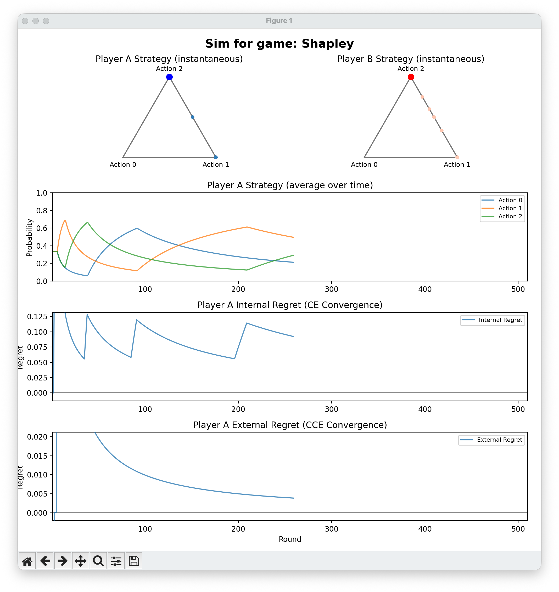
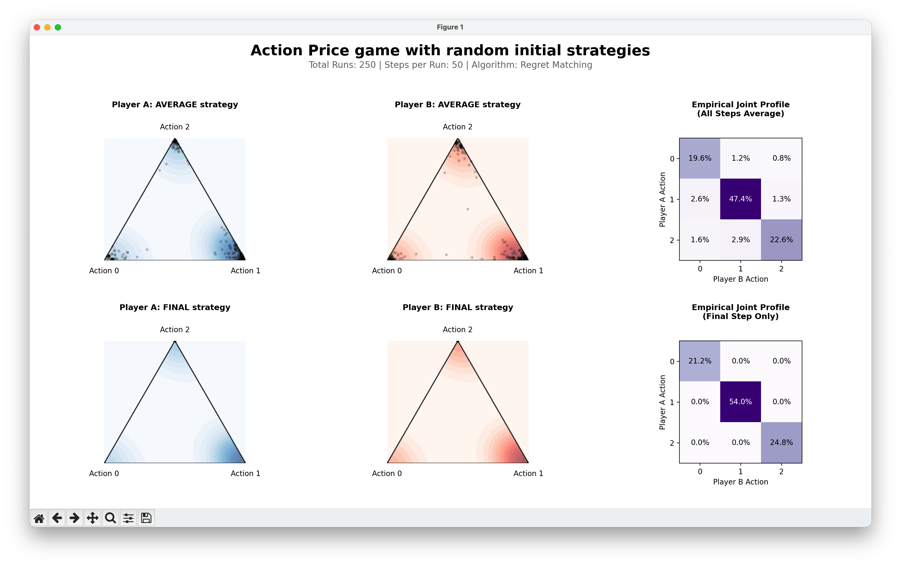
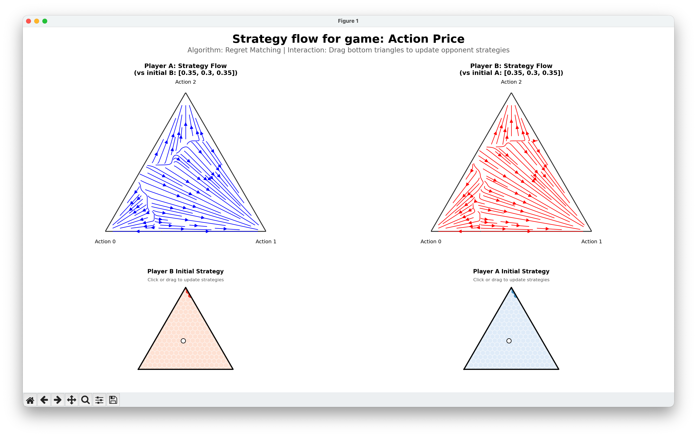

### Regret matching 

This repo contains some basic regret matching code and some games to run it on. It can plot results from self-play in real time. 

<table style="width: 100%; border-collapse: collapse;">
  <tr>
    <td align="center" width="33%">
      
      <br>strategy_convergence
    </td>
    <td align="center" width="33%">
      
      <br>monte_carlo
    </td>
    <td align="center" width="33%">
      
      <br>stream_plots
    </td>
  </tr>
</table>


#### Dependencies
This project uses `uv` for package management.
```bash
# On macos
brew install uv
```

#### Quick start :)
Note that all these games can be edited in the corresponding experiment code.

```bash
git clone https://github.com/yasuiniko/regret-matching.git
cd regret_matching

# convergence and non-convergence of regret matching in a Shapley game
uv run python -m experiments.strategy_convergence

# visualize joint strategies in a double auction game
uv run python -m experiments.monte_carlo

# visualize per-player learning trajectories in a double auction game
uv run python -m experiments.stream_plots
```

#### Algorithms
Currently everything is happening in the full information setting (cf bandit information).
1. 'Regret matching with strategies' knows both players' mixed strategies and uses their product to compute regret.
2. 'Regret matching with actions' only knows both players' realized strategies. Here realized means that each player randomly samples an action from their strategy, and the sampled actions are observed by all players. 

#### Games
1. **Matching Pennies**. Only has one Nash equilibrium which regret matching's average history of play approaches over time, unless the players start in equilibrium. 
2. **Chicken**. There are 3 Nash equilibria. The pure Nash equilibria are reached very quickly by the last iterate strategies of both players from almost any starting position. The only exception is when the players start in the unique mixed Nash equilibrium. 
3. **Shapley**. This game also has only one Nash equilibrium, but the average history of play does not converge to any stationary distribution. 
4. **Action Price**. This game describes a double auction for an essential good where the row player is the buyer and the column player is the seller. The buyer values the item at 5 and the seller values the item at 3. The mechanism is that the players are matched if the buyer reports higher than the seller. The buyer pays the price they reported, and their payoff is the delta between their valuation of 5 and the paid amount. The seller receives the price they reported, and their payoff is the delta between their valuation of 3 and the received amount. The auctioneer gets the delta between the two reported values. If there is no match, the buyer must purchase the good from a third party at 7 and the seller must sell the good to a third party at 1. The 3 pure strategy Nash equilibria are bolded. The truthful profile is italicized.
    
    | Buyer \ Seller | $p_s = 3$ | $4$ | $5$ |
    | :--- | :---: | :---: | :---: |
    | $p_b = 3$ | $\textbf{(2, 0)}$ | $(-2, -2)$ | $(-2, -2)$ |
    | $4$ | $(1, 0)$ | $\textbf{(1, 1)}$ | $(-2, -2)$ |
    | $5$ | $\textit{(0, 0)}$ | $(0, 1)$ | $\textbf{(0, 2)}$ |